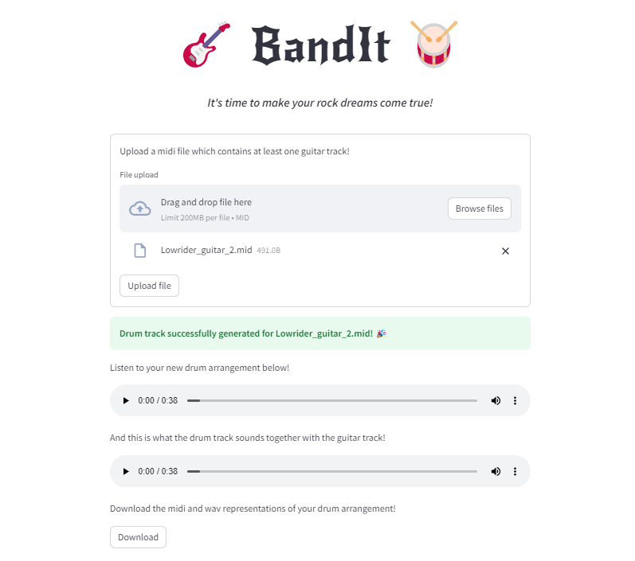

# BandIt
The goal of the BandIt project is to train a model that allow music creators to generate custom musical arrangements in different instruments for a given song, based on a recording of one instrument. In this first implementation, we are focusing on guitar as the input instrument, and drums as the output instrument. We have  limited our training dataset to songs within the rockc genre.

Exploring existing and custom transformer models, we are treating the task of generating a drum arrangment based on a guitar track as a form of translation task.

The code can be run locally using streamlit and uvicorn. The requirements.txt file contains requirements for the frontend, the requirements_prod.txt requirements for the backend. The Makefile includes some shorthand commands for this.

## Repo structure
### data
Contains midi (.mid) files.
### backend
main.py - Currently contains the code used to generate a piano midi track from [pop2piano](https://huggingface.co/sweetcocoa/pop2piano), and then turn that into a drum midi track. In the future, we envision using our custom trained model.
#### api
API endpoints for making predictions.
#### ml_logic
Will contains functions for preprocessing, postprocessing, training?, and predicting with our custom model.
### frontend
Contains the streamlit app that will serve as our user interface.
### notebooks
Notebooks for exploration and development.
### tests
Any tests and test data will go here.
